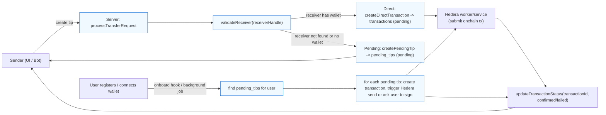

# TipJar — Technical Documentation

## Overview

TipJar is a peer-to-peer micro-payment system built on Hedera. It enables sending and receiving small-value tokens (HBAR by default) using either an in-app experience or via Twitter handles. The system supports both direct transfers to registered users with wallets and "pending" tips for recipients who don't yet have a profile or wallet.

Category: Onchain Finance & RWA
Subtrack: Financial Inclusion

## Problem Statement

- Many people around the world lack access to traditional banking rails or find fees for small payments prohibitive.
- Web3 onboarding can be intimidating for non-technical users.
- Social platforms (e.g., Twitter) are where people gather; connecting onchain payments to social handles lowers friction.

TipJar addresses these issues by enabling low-fee, social-handle-based tipping and deferred claim flows for users who are not yet onboarded.

## Key Concepts & Flows (Contract)

- Inputs: send request (senderId, receiverHandle, amount, token?, note?)
- Outputs: TransferResult (type: direct | pending) plus transaction or pendingTip id and receiver metadata.
- Error modes: invalid handle, insufficient balance (handled upstream by wallet service), DB errors, Hedera tx failure.

Edge cases considered:

- Receiver not registered: store a pending tip (sender is informed that receiver must sign up to claim).
- Receiver registered but no wallet: store pending tip linked to receiver id.
- Receiver registered with wallet: create direct transaction record and return the receiver wallet address so the hedera service can dispatch the onchain transfer.

## High-level Architecture

- Client (Next.js): UI for creating transfers, connecting wallets, viewing history.
- Server (Node/TypeScript): REST API + bot worker. Handles transfer logic, DB (Drizzle), and Hedera integration.
- Hedera service: constructs, signs (or coordinates signing), and submits transactions.
- Twitter bot: listens for mentions / commands, creates transfer requests and replies to users.
- Database: stores `users`, `transactions` and `pending_tips`.

Components and responsibilities

- `server/src/services/transfer.service.ts` — core transfer logic: validateReceiver, createPendingTip, createDirectTransaction, processTransferRequest, updateTransactionStatus, getTransactionById.
- `server/src/services/hedera.service.ts` — interacts with Hedera network to dispatch and confirm transactions.
- `server/src/controller/transfer.ts` — HTTP endpoints to create transfers and return results to the client.
- `server/src/bot/*` — bot that parses Twitter mentions and triggers transfers via the service.

## Data model (summary)

- users: { id, twitter_handle, wallet_address, created_at, ... }
- transactions: { id, sender_id, receiver_id, token, amount, note, status, tx_hash }
- pending_tips: { id, sender_id, receiver_id (nullable), receiver_twitter, amount, token, note, status }

Note: amounts are stored as strings currently (to avoid precision issues) and token is typically "HBAR".

## Important server flows (detailed)

1. Send tip to an on-platform user with wallet (direct transfer)

## Flow diagram (mermaid)

Below is a simplified visual of the two main flows (direct transfer vs pending tip + claim). It shows how a send request is processed, where DB records are created, and how pending tips are claimed after onboarding.



This chart is intentionally simplified. In production there are additional steps such as authentication, rate-limiting, retries, notifications (inform sender and receiver), and audit/logging around each transition.

## Detailed diagram (dashed = pending / not-yet-completed)

The diagram below uses dashed arrows to show paths or steps that represent "pending" work or places where a user action is required (for example: recipient onboarding). Solid arrows indicate automated/complete paths.

```mermaid
flowchart LR
  Sender["Sender (UI / Bot)"] -->|"create tip"| Server["Server: processTransferRequest"]
  Server --> Validate["validateReceiver(receiverHandle)"]

  %% Direct (solid): immediate processing
  Validate -->|"receiver has wallet"| Direct["createDirectTransaction\n(transactions: pending)"]
  Direct -->|"worker: submit onchain tx"| Hedera["Hedera service"]
  Hedera -->|"confirmed / failed"| Update["updateTransactionStatus"]
  Update -->|"notify sender"| Sender

  %% Pending (dashed): requires recipient action to complete
  Validate -.->|"receiver not found OR no wallet"| Pending["createPendingTip\n(pending_tips: pending)"]
  Pending -.->|"notify recipient (DM / email)"| Recipient["Recipient (no profile / no wallet)"]

  %% Claim path after onboarding (dashed to show user-driven)
  Recipient -.->|"registers / connects wallet"| ClaimTrigger["onboard hook / background job"]
  ClaimTrigger -.->|"find pending tips"| FindPending["query pending_tips WHERE receiver = user"]
  FindPending -.->|"for each: create transaction"| ForEach["createDirectTransaction or request user signature"]
  ForEach --> Hedera
  ForEach --> Update

  classDef pending stroke-dasharray: 3 3;
  class Pending,Recipient,ClaimTrigger,FindPending,ForEach pending;
```



Use this version in slides or documentation when you want to emphasize which steps require human action versus those that are handled automatically by the system.

- Caller constructs TransferRequest (senderId, receiverHandle, amount, token?, note?).
- `processTransferRequest` calls `validateReceiver(receiverHandle)`.
- If validation returns `type: "direct"` with `walletAddress`, the server:
  - creates a `transactions` DB record with status `pending` via `createDirectTransaction`.
  - returns TransferResult with type `direct`, `transactionId`, `receiverWalletAddress`, and `receiverId`.
  - Next, a Hedera worker or service picks up pending transactions and orchestrates onchain transfer using the receiver wallet address and updates the transaction status via `updateTransactionStatus`.

2. Send tip to a user not registered or without a wallet (pending tip)

- `validateReceiver` returns `type: "pending"` and optionally `receiverId` if a user exists but hasn't connected a wallet.
- The server creates a `pending_tips` record via `createPendingTip`, linking `receiver_id` (nullable) and `receiver_twitter`.
- The result returned to the sender is `type: "pending"`, containing `pendingTipId`, `receiverExists` (boolean), and `receiverId` (nullable).
- The sender-facing UI / bot reply should clearly inform the sender: "Tip recorded — recipient doesn't have a connected wallet yet. We'll notify them; once they sign-up and connect a wallet, they can claim the tip." This provides an explicit, friendly user experience.

3. Claiming a pending tip after user onboarding

- When a user registers/links a wallet, a background job or onboarding hook should:
  - find `pending_tips` where `receiver_twitter` or `receiver_id` matches the user and status = `pending`.
  - For each pending tip: create a `transactions` record and trigger an onchain transfer (or notify the user to sign the pending transaction depending on security and custody flow).
  - Update pending tip status to `completed` and attach transaction id or mark as `failed` if necessary.

Implementation note: There are two claim flows depending on custody model:

- Custodial-disbursement: server/treasury performs the onchain send to the receiver's connected wallet.
- User-signed claim: server creates an unsigned transaction and the user must sign to receive funds. This is more decentralized but requires UX for signing.

## API Endpoints (examples)

- POST /api/transfer — accepts TransferRequest, returns TransferResult.
- GET /api/transactions/:id — fetch a transaction by id.
- POST /api/onboard/complete — called when a user finishes onboarding to disburse pending tips.

## Bot Interactions

- The Twitter bot listens for mentions and commands. When a tip command is detected, it calls the same server-side `processTransferRequest` logic and replies to the sender with either:
  - Direct transfer message (includes that the transfer has been queued/created and will be processed), or
  - Pending tip message (clear explanation that recipient must register/connect a wallet to claim). Include the `pendingTipId` so support or debugging can reference it.

Suggested user-friendly messages (examples):

- Direct: "Thanks — your tip to @alice is queued! Transaction id: <id>. We'll notify you when it's confirmed."
- Pending (recipient exists but no wallet): "Thanks — your tip to @bob is saved, but Bob hasn't connected a wallet yet. He'll be able to claim it once he connects."
- Pending (recipient not registered): "Thanks — your tip to @carol is saved, but Carol doesn't have a TipJar profile yet. When she creates one, she can claim this tip."

## Security and Fraud Considerations

- Rate limiting: limit tips per sender per time window to reduce spam and exploitation.
- Input validation: sanitize and validate `receiverHandle` and amounts.
- Transaction replay / duplication: rely on DB constraints and idempotency keys where appropriate.
- Sensitive operations (onchain signing) should be performed in trusted services with limited access.

## Operational & Deployment Notes

- Environment variables required for production: Hedera credentials, DB connection, Twitter API keys, JWT secrets.
- Recommended workers: Background worker to process pending transactions and to check Hedera transaction confirmations.

## Tests and QA

- Unit tests for `transfer.service` flows: validateReceiver (registered/unregistered), createPendingTip, createDirectTransaction, processTransferRequest.
- Integration test: end-to-end tip via bot + onboarding and claiming pending tip.

## Next steps & improvements

- Improve UX for claiming pending tips: show pending tips in-app and send email/Twitter DMs to the recipient.
- Offer both custodial and non-custodial claim flows; consider UX and regulatory tradeoffs.
- Add metrics/telemetry for tip volume, claim rates, and fees.

---

Document created for maintainers and integrators.

## ASCII-style block diagram (slide-friendly)

Below is an ASCII diagram you can copy into slides or a text document. It highlights the main TipJar components and which steps are automated vs. user-driven (pending). Use the dashed box to indicate where a recipient action is required.

```text
┌──────────────────────────┐    ┌────────────────────────────┐    ┌──────────────────────────┐
│     Sender (UI / Bot)    │    │     Server: Transfer SRVC   │    │     Hedera / Onchain      │
│ - Compose tip            │    │ - validateReceiver()       │    │ - submit transactions     │
│ - Confirm & submit       │    │ - createDirectTransaction  │    │ - confirm / return txHash │
│ - See status updates     │    │ - createPendingTip         │    │ - notify status           │
└──────────────────────────┘    └────────────────────────────┘    └──────────────────────────┘
            │                             │                                  │
            │                             │                                  │
            └───────────┬─────────────────┴──────────────┬───────────────────┘
                        │                                │
              ┌──────────────────────────────────────────────────────────┐
              │               Pending Tips / DB (pending_tips)           │
              │  • stores tips when receiver not found OR no wallet      │
              │  • fields: id, sender_id, receiver_id (nullable),      │
              │    receiver_twitter, amount, token, note, status       │
              │  • status: pending, completed, failed                  │
              └──────────────────────────────────────────────────────────┘
                        │                                │
                        │                                │
            ┌───────────┴────────────┐        ┌───────────┴────────────┐
            │  Recipient: no profile │        │ Recipient: has wallet  │
            │  (pending claim)       │        │ (direct receive path)  │
            │  - notified to signup  │        │ - receives onchain     │
            │  - signs up / connects │        │   funds once tx done   │
            │    wallet              │        │ - can view transactions│
            └────────────────────────┘        └────────────────────────┘

Notes:
- Solid paths indicate automated/server-handled steps (validation, DB writes, hedra submissions).
- The boxed "Pending Tips / DB" area represents stored items that await recipient action. Once the recipient registers and connects a wallet, a background job or onboarding hook should process pending tips and trigger the onchain send.
- For slide decks, paste this ASCII art into a monospace text box or convert to an image for consistent rendering.

If you'd like, I can also export this diagram as an SVG and add it to `docs/` for inclusion in slides.
```
